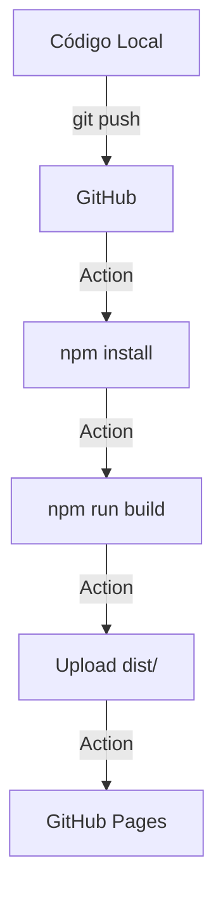

# 💻 Stack e Padrões de Desenvolvimento

## 🎯 Objetivo
Garantir código limpo, performático e fácil de customizar, usando apenas JS/HTML/CSS puros + Firebase v9 modular.

---

## 🧱 Estrutura de Pastas
```
/src
  /components     (Header.js, Footer.js, theme-loader.js, landing.js, certificates.js, dashboard.js)
  /services      (firebase.js, auth.js)
  /styles        (variables.css, layout.css, landing.css)
  /utils         (constants.js, helpers.js)
/public
  logo_atual.png, icone.png, *.jpg (cursos)
/index.html      (Landing Page)
/dashboard.html  (Painel do Aluno)
```

---

## 📜 Padrões de Código

### JavaScript (ES6+)
- Módulos ES6 (`import`/`export`)
- `const`/`let` obrigatório
- Funções pequenas (< 30 linhas)
- JSDoc em services
- Web Components para reutilização

### HTML
- Semântico (`<section>`, `<article>`, `<nav>`)
- `aria-*` para acessibilidade
- Sem inline styles
- Caminhos relativos (`./src/...`)

### CSS
- Mobile-first (base styles são mobile)
- CSS Variables para temas
- Flexbox/Grid para layouts
- BEM lite para nomenclatura
- Zero `!important`
- Espaçamentos em `rem`, não `px`

### Componentização
- `customElements.define()` para Web Components
- Shadow DOM opcional
- Eventos delegados

---

## 🔌 Integração Firebase

### SDK v9 Modular
```javascript
import { getFirestore, doc, getDoc } from "firebase/firestore";
```

### Inicialização
```javascript
// firebase.js
import { initializeApp } from "firebase/app";
import { getFirestore } from "firebase/firestore";
import { getAuth } from "firebase/auth";

const firebaseConfig = { ... };
const app = initializeApp(firebaseConfig);
const db = getFirestore(app);
```

### Modo Demonstração
Quando Firebase não configurado, exibe warnings mas não bloqueia funcionalidade local.

---

## 🎨 Customização e Responsividade

### Breakpoints
```css
/* Mobile */
@media (max-width: 767px) { }

/* Tablet */
@media (min-width: 768px) and (max-width: 1023px) { }

/* Desktop */
@media (min-width: 1024px) { }
```

### CSS Variables (Theme)
```css
:root {
  --primary: var(--theme-primary, #0B1B5E);
  --secondary: var(--theme-secondary, #39C2D7);
  --font-main: var(--theme-font, 'Lato', sans-serif);
  --radius: var(--theme-radius, 0.5rem);
}
```

### Tema Dinâmico
- `<theme-loader>` busca `theme/{branchId}` no Firestore
- Injeta variáveis em `:root`

---

## 🧪 Testes e Validação

- Chrome, Firefox, Safari, Edge (desktop + mobile)
- Lighthouse: Performance, Accessibility, Best Practices > 90
- Form validation com Constraint Validation API
- Offline: `navigator.onLine` + localStorage para progresso pendente
- `console.warn()` para regras violadas (não `console.log`)

---

## ⚠️ Guardrails

1. **Nunca exponha chaves de API** no frontend
2. **Não usar `innerHTML`** sem sanitização
3. **Limpar `onSnapshot` listeners** no `beforeunload`
4. **Sempre `try/catch`** em chamadas Firebase
5. **Commit messages:** `feat:`, `fix:`, `refactor:`, `chore:`
6. **Documentar contratos** de dados em `utils/constants.js`

---

## 📱 Mobile-First Strategy

### Desktop First (OLD - não usar)
```css
.desktop-style { ... }
@media (max-width: 767px) { .mobile-style { ... } }
```

### Mobile-First (CORRETO)
```css
.mobile-style { ... }
@media (min-width: 768px) { .tablet-style { ... } }
@media (min-width: 1024px) { .desktop-style { ... } }
```

---

## 🔄 Deploy Workflow



---

*Documento atualizado em: 30/05/2026*
*Versão: 2.0*