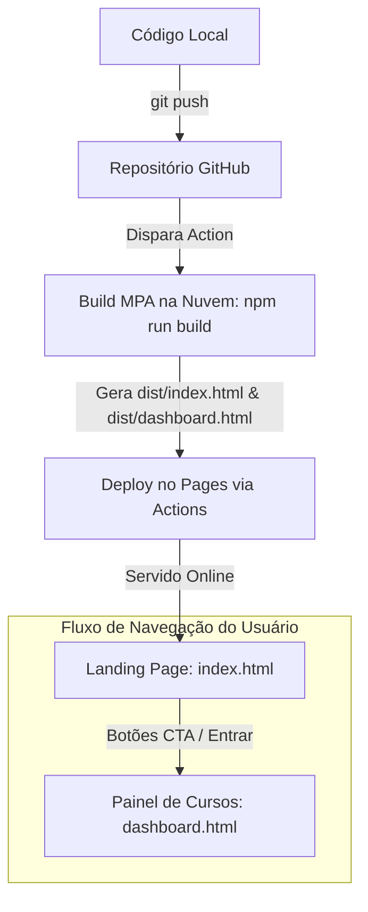

# 📝 Contexto do Desenvolvimento: Setup Inicial & Resolução de Problemas

Este documento serve como memorial descritivo das decisões arquiteturais, infraestrutura de deploy e correções realizadas durante a inicialização do layout base da plataforma **Academia do Extrajudicial**.

---

## 🚀 1. Setup Inicial com Vite
A "constituição técnica" do projeto (`stack_e_padroes.md`) define o uso do **Firebase SDK v9 modular** (ex: `import { getFirestore } ...`). 
- **Problema:** Navegadores não conseguem resolver importações diretas de dependências do npm (`bare imports` como `"firebase/firestore"`) nativamente em runtime sem um mapeamento específico.
- **Solução:** Adotamos o **Vite** como empacotador (bundler) e servidor de desenvolvimento local. O Vite resolve as dependências do npm em tempo de compilação, unificando todo o JavaScript em um bundle estático compatível com qualquer navegador moderno.
- **Estrutura de Pastas Implementada:**
  ```
  ├── .github/workflows/deploy.yml  # Pipeline de deploy automático (CI/CD)
  ├── agentes/                      # "Constituição técnica" do projeto
  ├── public/                       # Assets estáticos servidos na raiz (ex: logo.png)
  ├── src/
  │   ├── components/               # Web Components e utilitários (Header.js, Footer.js, theme-loader.js)
  │   ├── services/                 # Serviços centrais (firebase.js)
  │   ├── styles/                   # Folhas de estilo (variables.css, layout.css, landing.css)
  │   └── utils/                    # Utilitários (constants.js, etc.)
  ├── index.html                    # Ponto de entrada: Landing Page Institucional
  ├── dashboard.html                # Painel de Cursos (antigo index.html)
  ├── package.json                  # Dependências e scripts do Node.js
  ├── vite.config.js                # Configuração do compilador Vite (MPA)
  └── contexto.md                   # Este relatório explicativo
  ```

---

## 🛠️ 2. Deploy Automatizado no GitHub Pages
Para hospedar o site no endereço `https://renato0503.github.io/AcademiaDoExtrajudicial/`, configuramos um pipeline de deploy contínuo (CI/CD):

1. **Workflow de GitHub Actions (`.github/workflows/deploy.yml`):**
   - Roda a cada `push` enviado para a branch `main`.
   - Instala as dependências na nuvem, compila o projeto com `npm run build` gerando a pasta `/dist`.
   - Faz o deploy automático da pasta `/dist` diretamente nos servidores do GitHub Pages de forma segura e isolada.
2. **Configuração de Caminho Base (`vite.config.js`):**
   - Configuramos `base: '/AcademiaDoExtrajudicial/'` no Vite.
   - Isso garante que o Vite reescreva todas as referências de arquivos compilados (CSS, JS) apontando para o subdiretório correto do repositório no GitHub Pages, evitando falhas de carregamento (erros 404).

---

## 🏗️ 3. Landing Page Institucional & Arquitetura MPA
Com a evolução do projeto, surgiu a necessidade de criar uma **Landing Page Institucional** como porta de entrada principal da plataforma, mantendo a área de cursos em uma rota privada/interna.

1. **Estratégia Multi-Page Application (MPA) no Vite:**
   - Para que o Vite compile múltiplos arquivos HTML e os disponibilize na pasta de distribuição, configuramos o parâmetro `rollupOptions.input` no `vite.config.js`.
   - Mapeamos `index.html` (Landing Page) e `dashboard.html` (Painel do Aluno), que são compilados juntos na build.
2. **Migração do Painel de Cursos:**
   - O arquivo `index.html` original do Dashboard foi renomeado para `dashboard.html` na raiz do projeto.
   - O novo arquivo `index.html` foi criado para conter as seções da Landing Page (Hero, Sobre, Cursos, Benefícios, Stats, Depoimentos e CTA de entrada).
3. **Componentização Sem Frameworks (Web Components):**
   - Criamos os arquivos `src/components/Header.js` (cabeçalho) e `src/components/Footer.js` (rodapé) utilizando a API nativa de **Web Components** do navegador.
   - Isso encapsula a estrutura, os estilos e os comportamentos lógicos (scroll suave, animação do header ao scrollar, e alternância do menu mobile) em tags HTML customizadas (`<main-header>` e `<main-footer>`) em Javascript Vanilla puro.

---

## 🔍 4. Resolução de Erros Encontrados

### ❌ Problema A: Erros 404 ao Carregar Estilos e Scripts
- **Causa:** No HTML inicial, os caminhos estavam como `/src/...` (absolutos em relação ao domínio). No GitHub Pages, o navegador buscava os arquivos na raiz do domínio `https://renato0503.github.io/src/...` ignorando a pasta do subprojeto.
- **Solução:** Alteramos os caminhos do `index.html` para relativos (ex: `./src/styles/layout.css`).

### ❌ Problema B: Erro `TypeError: Failed to resolve module specifier "firebase/firestore"`
- **Causa:** O GitHub Pages estava configurado para servir a branch `main` diretamente (código cru). O navegador tentava rodar o script ES6 cru `theme-loader.js` sem passar pelo build do Vite, falhando ao importar dependências do npm.
- **Solução:** Mudamos a configuração do Pages no GitHub para usar **GitHub Actions** como fonte, forçando a publicação apenas dos artefatos da pasta `/dist` resolvidos e minificados.

### ❌ Problema C: Diamante Decorativo da Sidebar Cobrindo o Menu
- **Causa:** O pseudo-elemento `.sidebar::after` estava posicionado de forma absoluta a `top: 120px` e com opacidade `0.9`, ficando exatamente por cima do botão "Dashboard" e cobrindo o texto do menu.
- **Solução:** Reposicionamos o diamante para o canto inferior direito com `bottom: -30px; right: -30px`, reduzindo a opacidade para `0.15` (marca d'água discreta de fundo) e adicionamos `z-index: 2` na tag `nav` para forçar o empilhamento correto.

### ❌ Problema D: Logo Duplicada (Visual)
- **Causa:** A imagem da logo enviada pelo cliente (`logo.png`) já continha a tipografia e o texto "Academia do Extrajudicial". O HTML mantinha uma tag de texto ao lado, duplicando a informação visual.
- **Solução:** Removemos a tag de texto redundante e mantivemos apenas a imagem com a classe de estilo de redimensionamento responsivo.

### ❌ Problema E: Persistência de Erros por Cache
- **Causa:** O navegador do usuário retém o index.html antigo de desenvolvimento em cache de sessão.
- **Solução:** Instruído a limpar o cache ou a testar em **Janela Anônima** para descartar arquivos de sessões passadas.

---

## 📈 Resumo do Fluxo de Trabalho e Navegação

