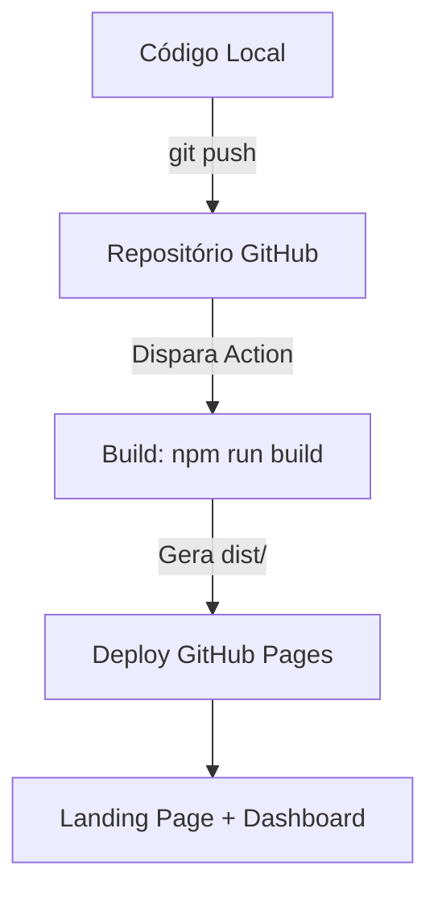

# 📝 Contexto do Desenvolvimento: Academia do Extrajudicial

## 🚀 Stack e Deploy

- **Vite** como bundler/empacotador para resolver dependências npm
- **Firebase SDK v9 modular** para autenticação, Firestore e Storage
- **GitHub Pages** com deploy automático via GitHub Actions
- **Base path:** `/AcademiaDoExtrajudicial/` para GitHub Pages

## 📁 Estrutura de Pastas
```
├── .github/workflows/deploy.yml  # CI/CD pipeline
├── agentes/                      # Documentação de agentes
├── public/                       # Assets estáticos (logo, icons)
├── src/
│   ├── components/               # Web Components (Header, Footer, theme-loader, landing, certificates, dashboard)
│   ├── services/                 # Firebase config
│   ├── styles/                   # CSS (variables, layout, landing)
│   └── utils/                    # Constants e helpers
├── index.html                    # Landing Page
├── dashboard.html                # Painel do Aluno
├── package.json
├── vite.config.js                # Config MPA
├── contexto.md                   # Este arquivo
└── contexto.md
```

---

## 🎨 Design System Implementado

### Cores (CSS Variables)
```css
--blue-deep: #0B1B5E      /* Primary */
--blue-medium: #172B7A     /* Header mobile mais claro */
--teal: #39C2D7           /* Accent - azul Tiffany */
--teal-light: #7DD3E0
--bg-white: #FFFFFF
--bg-light: #F4F6FA
--text-primary: #0B1B5E
--text-secondary: #6E6E73
```

### Tipografia
- **Display:** Montserrat (700, 800)
- **Body:** Lato (400, 700)
- **Fallback:** system-ui, sans-serif

### Breakpoints
- **Mobile:** max-width 767px
- **Tablet:** 768px - 1023px
- **Desktop:** min-width 1024px

---

## 📱 Responsividade Implementada

### Mobile (< 767px)
- Header desktop oculto
- Botão flutuante losango (rotated 45°) em azul Tiffany (#39C2D7)
- Menu expandido centralizado acima do botão
- Hero: ícone estático centralizado acima da tagline, conteúdo em coluna
- Footer: grid de 1 coluna
- Bottom spacer para não sobrepor conteúdo

### Tablet (768px - 1023px)
- Header desktop oculto
- Menu flutuante oculto
- Hero: grid de 1 coluna, centralizado
- Cursos: grid de 2 colunas

### Desktop (≥ 1024px)
- Header desktop com navegação horizontal glassmorphism
- Menu hamburger oculto
- Hero: grid de 2 colunas (1.2fr 1fr)
- Cursos: grid de 3 colunas

---

## 🔧 Componentes Implementados

### `<main-header>` (Web Component)
- **Desktop:** Header com logo, navegação horizontal, botões Entrar/Cadastrar
- **Mobile:** Botão flutuante losango + menu expandido
- Funcionalidades:
  - Scroll effect (header sólido ao rolar)
  - Smooth scroll para âncoras
  - Toggle do menu mobile
  - Fecha ao clicar fora ou no botão novamente
  - X removido do menu (fecha pelo botão ou backdrop)

### `<main-footer>`
- Logo + links + copyright

### `<theme-loader>`
- Carrega tema do Firestore
- Aplica CSS Variables

### Landing Components
- Scroll animations (Intersection Observer)
- Lazy loading de imagens
- Modal de busca (Ctrl+K)
- Header effects

---

## 🎯 Funcionalidades da Landing Page

### Seções
1. **Hero:** Título, tagline, CTAs, ícone estático, mockup do dashboard
2. **Sobre:** Grid de 3 cards (Missão, Visão, Valores)
3. **Cursos em Destaque:** Grid de cursos com thumbnails
4. **Benefícios:** Rows alternadas (texto + ícone visual)
5. **Stats:** Números com contagem animada
6. **Diferenciais:** Cards com ícones
7. **CTA Final:** Chamada para ação
8. **Footer:** Links e copyright

### Navegação
- Scroll suave para âncoras
- Links ativos baseados na seção visível (Intersection Observer)
- Botão flutuante menu no mobile

---

## 🗃️ Modelagem de Dados (Firestore)

### Collections
- `users/{userId}` - perfil, role, pontos, badges, streak
- `courses/{courseId}` - título, descrição, módulos, статистики
- `modules/{moduleId}` - courseId, ordem, pré-requisitos
- `lessons/{lessonId}` - moduleId, tipo (video/pdf/quiz), contentUrl
- `enrollments/{userId_courseId}` - status, progresso, deadline
- `progress/{userId_lessonId}` - completed, watchedSeconds, attempts
- `certificates/{certificateId}` - hash, pdfUrl, status
- `themes/{branchId}` - cores, fontes, logo
- `notifications/{userId}/items/{notificationId}` - type, read, createdAt

### Roles
- `admin` - CRUD total
- `gestor_rh` - gestão de cursos e usuários
- `instrutor` - criação de conteúdo
- `colaborador` - consumo de cursos

---

## 🏆 Gamificação

### Sistema de Pontos
- +10 por aula concluída
- +50 por curso finalizado
- +5 por dia de streak

### Badges
- primeiro_curso, conformidade_total, consistency_mensal, etc.

---

## 📜 Certificados

### Estrutura
- Nome do aluno, curso, data, hash SHA-256
- QR Code para validação
- Geração via jsPDF no cliente

### Validação
- URL pública: `/validate?hash=XXXXX`

---

## ⚠️ Problemas Resolvidos

1. **404 em assets** - caminhos relativos `./src/...` ao invés de `/src/...`
2. **Firebase não configurado** - modo demonstração local com warnings
3. **Menu mobile quebrado** - reimplementado com botão flutuante losango
4. **Header desktop afetado** - CSS isolation para mobile/desktop
5. **Sintaxe bracket** - removido bracket extra causando quebra no desktop
6. **Logo sem fundo** - header mobile mais claro para contraste

---

## 🔄 Fluxo de Trabalho



---

## 📅 Histórico de Commits

| Data | Commit | Descrição |
|------|--------|-----------|
| 30/05 | fix: hide mobile elements on desktop | Restaurar desktop |
| 30/05 | fix: bracket syntax error | Correção desktop quebrado |
| 30/05 | feat: diamond button teal | Botão losango azul Tiffany |
| 30/05 | feat: diamond button teal, no close X, hero mobile layout | Menu mobile melhorado |
| 30/05 | fix: icon static centered above tagline | Ícone hero mobile |
| 30/05 | feat: diamond button, no close X | Menu losango sem X |
| 30/05 | feat: floating menu button hidden until scroll | Botão aparece após scroll |
| 30/05 | feat: bottom nav centralizado | Navigation bottom |
| 30/05 | fix: header mobile contrast | Header mais claro |
| 30/05 | docs: workflow completo | Documentação atualizada |

---

*Documento atualizado em: 30/05/2026*
*Versão: 2.0*