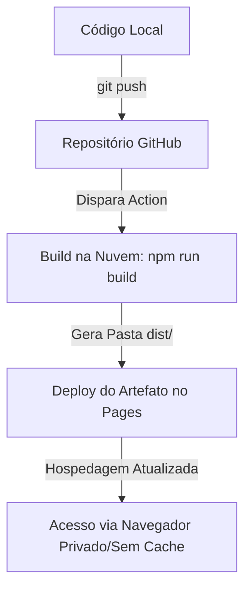

# 📝 Contexto do Desenvolvimento: Setup Inicial & Resolução de Problemas

Este documento serve como memorial descritivo das decisões arquiteturais, infraestrutura de deploy e correções realizadas durante a inicialização do layout base da plataforma **Academia do Extrajudicial**.

---

## 🚀 1. Setup Inicial com Vite
A "constituição técnica" do projeto (`stack_e_padroes.md`) define o uso do **Firebase SDK v9 modular** (ex: `import { getFirestore } ...`). 
- **Problema:** Navegadores não conseguem resolver importações diretas de dependências do npm (`bare imports` como `"firebase/firestore"`) nativamente em runtime sem um mapeamento específico.
- **Solução:** Adotamos o **Vite** como empacotador (bundler) e servidor de desenvolvimento local. O Vite resolve as dependências do npm em tempo de compilação, unificando todo o JavaScript em um bundle estático compatível com qualquer navegador moderno.
- **Estrutura de Pastas Implementada:**
  ```
  ├── .github/workflows/deploy.yml  # Pipeline de deploy automático (CI/CD)
  ├── agentes/                      # "Constituição técnica" do projeto
  ├── public/                       # Assets estáticos servidos na raiz (ex: logo.png)
  ├── src/
  │   ├── components/               # Componentes (ex: theme-loader.js)
  │   ├── services/                 # Serviços centrais (ex: firebase.js)
  │   ├── styles/                   # Folhas de estilo (variables.css, layout.css)
  │   └── utils/                    # Utilitários (constants.js, etc.)
  ├── index.html                    # Ponto de entrada HTML na raiz
  ├── package.json                  # Dependências e scripts do Node.js
  ├── vite.config.js                # Configuração do compilador Vite
  └── contexto.md                   # Este relatório explicativo
  ```

---

## 🛠️ 2. Deploy Automatizado no GitHub Pages
Para hospedar o site no endereço `https://renato0503.github.io/AcademiaDoExtrajudicial/`, configuramos um pipeline de deploy contínuo (CI/CD):

1. **Workflow de GitHub Actions (`.github/workflows/deploy.yml`):**
   - Roda a cada `push` enviado para a branch `main`.
   - Instala as dependências na nuvem, compila o projeto com `npm run build` gerando a pasta `/dist`.
   - Faz o deploy automático da pasta `/dist` diretamente nos servidores do GitHub Pages de forma segura e isolada.
2. **Configuração de Caminho Base (`vite.config.js`):**
   - Configuramos `base: '/AcademiaDoExtrajudicial/'` no Vite.
   - Isso garante que o Vite reescreva todas as referências de arquivos compilados (CSS, JS) apontando para o subdiretório correto do repositório no GitHub Pages, evitando falhas de carregamento (erros 404).

---

## 🔍 3. Resolução de Erros Encontrados

### ❌ Problema A: Erros 404 ao Carregar Estilos e Scripts
- **Causa:** No HTML inicial, os caminhos estavam como `/src/styles/layout.css` (absolutos em relação ao domínio). No GitHub Pages, o navegador tentava buscar os arquivos em `https://renato0503.github.io/src/...` em vez de `https://renato0503.github.io/AcademiaDoExtrajudicial/src/...`.
- **Solução:** Alteramos os caminhos do `index.html` para relativos (adicionando `./` no início, ex: `./src/styles/layout.css`). O Vite intercepta essas referências locais e injeta os caminhos de build corretos.

### ❌ Problema B: Erro `TypeError: Failed to resolve module specifier "firebase/firestore"`
- **Causa:** O GitHub Pages estava configurado para servir a branch `main` diretamente (modo "Deploy from branch"). Isso servia o código-fonte cru de desenvolvimento. O navegador tentava executar o arquivo `theme-loader.js` nativo sem passar pela compilação do Vite, estourando erro de importação do Firebase.
- **Solução:** Mudamos a configuração do GitHub Pages no repositório para utilizar **GitHub Actions** como fonte. Agora ele serve os arquivos gerados pela build na pasta `/dist` (onde o Firebase está embutido e resolvido dentro do JavaScript de produção).

### ❌ Problema C: Erro 404 no Favicon
- **Causa:** Navegadores buscam automaticamente por `/favicon.ico` na raiz, gerando logs de erro 404 caso o arquivo não exista.
- **Solução:** Injetamos um favicon SVG dinâmico inline diretamente no `<head>` usando um emoji de diamante (`💎`):
  ```html
  <link rel="icon" href="data:image/svg+xml,<svg xmlns=%22http://www.w3.org/2000/svg%22 viewBox=%220 0 100 100%22><text y=%22.9em%22 font-size=%2290%22>💎</text></svg>">
  ```

### ❌ Problema D: Logo Duplicada (Visual)
- **Causa:** A imagem da logo enviada pelo cliente (`logo.png`) já continha o texto estilizado "Academia do Extrajudicial". No HTML, mantínhamos ao lado a tag `<div class="logo-text">`, gerando repetição e poluição visual.
- **Solução:** Removemos a tag de texto do HTML e mantivemos apenas a imagem `logo.png` (copiada pelo Vite para a raiz da pasta `/dist`), além de ajustar a classe `.logo-img` no CSS para redimensionar a logo de forma responsiva e limpa.

### ❌ Problema E: Persistência de Erros no Navegador (Mesmo após Correção)
- **Causa:** O navegador do usuário retém o arquivo `index.html` anterior em cache de sessão. Mesmo com a build corrigida publicada pelo GitHub Actions, o navegador continuava lendo a versão local em cache que apontava para o script de desenvolvimento com os erros do Firebase.
- **Solução:** Instruído o teste utilizando uma **Janela Anônima** (que ignora o cache local) para validar o deploy em tempo real após a conclusão das esteiras de build.

---

## 📈 Resumo do Fluxo de Trabalho (Workfow)

